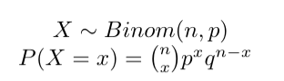
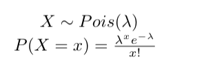
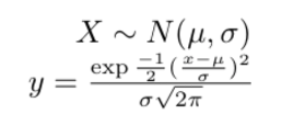

# Week 2 -- Part 2

## Week 2 Learning Objectives

By the end of Weeks 2 & 3, you will be able to

* Compare and contrast discrete and continuous distributions
* Describe the characteristics of and graphical appearance of probability distributions important for biology.
* Determine what probability distribution satisfies the necessary requirements given information and assumptions about data/processes.
* Use sample data to find actual results and use probabilities to find expected results.
* Describe the relation between population-based and sample-based information.
* Use estimation to infer or estimate the value of a population parameter given sample data.
* Differentiate between unbiased and biased estimators.
* Construct confidence intervals for estimated parameters.
* Describe the difference between the non-parametric and parametric bootstrap. Apply the bootstrap in confidence interval estimation and to compare two data sets.
* Determine minimum sample sizes necessary for estimation.
* Develop the ability to identify the null and alternative hypotheses when given some claim about a population
* Use sample data to test hypotheses or claims made about population parameters and state the conclusions in both technical terms (of rejecting or failing to reject the null hypothesis) and simple terms.
* Use hypothesis testing to test whether real and expected results differ significantly.
* Employ multiple hypothesis testing correction when appropriate.
* Accurately define, use, and compare p-values.

## Probability Distributions

### Parameters

Last lecture we broadly discussed the requirements of any probability distribution and the uses of the distribution to find expected results or the probability that a random variable takes on a specific value or a value in a specific range of values. There are many specific probability distributions, each of which has specific characteristics, assumptions, and *PMF*, *PDF*, or *CDF* functions. With a probability distribution, we have a description of a population. Therefore the *parameters* (such as a mean or expected value, the variance, or possibly the probability of success) of a given probability distribution are the parameters of the population too. The mean (expected value), standard deviation, and variance parameters can be computed for most probability distributions (exceptions are rare).

### Expected Value

The expected value of random variable is the predicted or likely outcome/value that a random variable will take on, essentially summarizing the center of the random variable or the mean.

If we want to find the expected value of a specific distribution, often a specific formula will be available that utilizes parameters from the definition of the distribution. However, we can also take the *expectation* for any random variable using the formulas below as a guide.

#### Expected Value -- Discrete cases

Given a *discrete random variable* X with a *PMF* P(X), which specifies the P(X = x) for every possible x in X, we can find the expected value parameter of the probability distribution using the following equation, where we sum across every value x. In this way, the expected value is a weighted average of the possible values of a random variable, where the weights are the probabilities from the PMF.

#### Expected Value -- Continuous cases

We can calculate an expected value for a continuous random variable given a *continuous random variable* X with a *PDF* f(x), which specifies the probability density, or the probability for a range of values. (If needed, please see [this video for a refresher on the probability density function (PDF)](https://youtu.be/6Osba2KLTuk).) The formula for calculating the expected value of a continuous random variable utilizes an integral rather than a summation and the PDF rather than the PMF. These differences are because of the nature of a continuous random variable and that the P(X=x) = 0 for all x. This function is still essentially a weighted average of all the possible values by using the integral (for summations of an infinite number of nearly width 0 rectangles).

### Variance

The variance measures the spread of the random variable around its center or expected value; it is the average of the squared deviations of the random variable from its mean or expected value. In general this is found by the following formula for both discrete and continuous random variables where the expectation-squared of the random variable is subtracted from the expectation of the squared random variable. (Recall that the *expectation* is how the expected value can be found)

Note that the standard deviation is still the square root of the variance.

Much like with the expected value, specific distributions often have specific formulas associated with them for calculating a distributions variance. These formulas utilize parameters from the definition of the distribution. However, we can use the above formula to find the variance for any random variable.

#### Variance -- Discrete cases

There are two formulas for finding the variance in the case of a discrete random variable. The first more closely matches the definition while the second is easier to compute manually.

### Common Distributions

For a random variable or set of data to be distributed according to a specific distribution, that means the parameters of that distribution are assumed to be true for that random variable's population; also, any assumptions or characteristics of the distribution must be reflected in the random variable or dataset as well. This could be as simple as the data being discrete data for a discrete distribution. We'll see more complex requirements of several distributions soon.

In biology, there are three common probability distributions which biological data are often distributed according to. These are the *Binomial*, *Poisson*, and *Gaussian (Normal)* distributions. The Binomial and Poisson distributions are discrete probability distributions while the Normal is a continuous probability distribution.

#### Uniform Distribution

We briefly discussed a uniform distribution in class, and for the continuous case and some range of values between a and b (an inclusive range [a, b]), there are an infinite number of values possible, and every value has an equal probability density. For the discrete case and some range of values between a and b (again an inclusive range [a, b]), there is a finite number of values possible, and every value has an equal probability. The PDF of a continuous uniform distribution is a rectangular shape. It is a straight horizontal line with veritcal lines at a and b [as seen here in Wolfram MathWorld](https://mathworld.wolfram.com/UniformDistribution.html). The PMF of a discrete uniform distribution are vertical lines of the same height at every discrete value a to b.

### Common Distributions -- Discrete

#### Binomial Distribution

The Binomial distribution is a probability distribution that describes the number of successes that are observed in n independent trials where the trials share the same probability of success.

The assumptions/characteristics of the Binomial distribution are
* Whatever random variable or process is being considered has a **fixed number of trials/observations**, we denote this `n`
* The trials are **independent** meaning that the outcome of one doesn't affect the outcome of another
* Each trial can only have two possible outcomes: success or failure (AKA positive or negative; 0 or 1; yes or no; etc.)
* The probability of success remains the same in all trials for a given random variable/process. This probability is often denoted as `p`.
  * Because there are only two outcomes, the probability of failure (often denoted `q`) must equal `1-p`.

A single trial which has only two possible outcomes and has a known probability of success is called a *Bernoulli trial*. A random variable which is distributed according to the Binomial distribution is really just a set of independent (outcome of one doesn't affect another outcome) and identically distributed (same probability of success across trials) Bernoulli trials. Therefore, if we only had a probability of success, we would have a Bernoulli distribution. But if we have a probability of success together with a number of independent trials, we define a Binomial distribution.

Parameters:
* The expected value of a Binomial distribution is `np`.
* The variance of a Binomial distribution is `npq` = `np(1-p)`

PMF
* We can use the `dbinom(x, size, prob)` function in R for this.
* The PMF of the Binomial distribution is:

CDF
* We can use the `pbinom(x, size, prob)` function in R for this.

We can generate a sample of data from the Binomial distribution in R using the `rbinom(n, size, prob)` function.

The parameters for these functions include `x`, `n`, `prob`, & `size`.
* `x` or the value/# of successes of interest for the number of trials. For the PMF, we ask the P(X = x) for this `x`. For the CDF, we ask the P(X <= x) for this `x`. This value can be anywhere in the inclusive range [0, n].
* `n` is the number of trials
* `prob` is the probability of success (what we called `p` earlier)
* `size` is the number of observations. How does this differ from the `n` parameter? Great question -- we'll have an example in class in week 3 that looks at this more deeply.

Of special note, this distribution appears to break our requirement that random variables and distributions be numerical, not categorical data as the outcomes are binary and clearly categorical nominal data. This exception seems to be allowed because success/failure can be encoded as 0 and 1 and so it's just a discrete distribution over the set of values {0, 1}.

A non-biological example of a Binomial distribution would be coin tosses. What are biological examples of datasets or variables that are distributed according to the Binomial distribution?

#### Poisson Distribution

The Poisson distribution is a probability distribution used to model the number of times a rare event occurs.

The assumptions/characteristics of the Poisson distribution are
* The random variable X is the number of occurrences of an event in some interval of time (where the occurrence is rare)
* The occurrences must be random
* The occurrences must be independent of each other
* The occurrences must be uniformly or randomly distributed over the interval being used (e.g. there is nothing causing them to cluster in one part of the interval)

Parameters:
* The expected value and the variance of the Poisson distribution are equal to each other and it is the mean or the mean number of occurrences of the event in the interval. We'll call this lambda.
* Because of this, we only need the mean to define a Poisson distribution.

PMF
* We can use the `dpois(x, lambda)` function in R for this.
* The PMF of the Poisson distribution is:

CDF
* We can use the `ppois(x, lambda)` function in R for this.

We can generate from the Poisson distribution in R using the `rpois(n, lambda)` function.

The parameters for these functions include
* `x`. This is the number of occurrences For the PMF, we ask the P(X = x) for this `x`. For the CDF, we ask the P(X <= x) for this `x`. The inclusive range for this is [0, infinity) where the possible values of x has no upper limit, but it is still discrete and countable.
* `lambda`. This is the mean or expected value of the distribution.
* `n`. This is the number of values to return if generating from the distribution.

Other notes about the Poisson distribution include that it can appear skewed (with a long tail) or it can appear symmetrical, but it doesn't have to be either. Further, for large n, and small probabilities of success, the Poisson distribution can be used to approximate a Binomial distribution. This is because the Poisson distribution is for rare events (low probability of success).

### Common Distributions -- Continuous

#### Normal (Gaussian) Distribution

The Normal distribution is a symmetric, bell-shaped probability distribution with mean mu and standard deviation sigma. If observations follow a normal distribution, the interval (mu +- 2*sigma) will contain 95% of the observations.  

The *standard normal distribution* has a mean of 0 and variance and standard deviation of 1.  

Parameters
* The expected value is mu or the mean
* The variance is sigma-squared or the square of the standard deviation.

PDF
* We can use the `dnorm(x, mu, sigma)` function in R for this.
* The PDF of the Normal distribution is:

CDF
* We can use the `pnorm(x, mu, sigma)` function in R for this.

We can generate from the Normal distribution in R using the `rnorm(n, mu, sigma)` function
The parameters for these functions include
* `x`. This is the number we ask about with the PDF or the CDF. For the CDF, we ask the P(X <= x) for this `x`. The range for this is (-infinity, infinity) where the possible values of x has no lower or upper limit, being continuous and infinite.
* `mu`. This is the mean or expected value of the distribution.
* `sigma`. This is the standard deviation of the distribution.
* `n`. This is the number of values to return if generating from the distribution.

### Statistical Inference

Briefly, [statistical inference is](http://jtleek.com/ads2020/week-8.html#a-framework-for-modeling) the practice of using probability to sample from a population, take measurements on (summarize) that sample, and the sample and summaries of the sample to make inferences about something or some characteristics on the population on average. The characteristics of the population that you are estimating from the summary values (from the sample) are the parameters. We will use information about sources of uncertainty to infer how accurate or precise are estimates are and can use hypothesis testing to look for differences between samples or between samples and a population.

### Hypothesis testing intro

*Hypothesis testing* is an approach used in statistical inference to compare samples and populations or to compare samples with each other.

#### Null vs Alternative Hypothesis

The *null hypothesis* (H0 or H-naught) is the hypothesis being tested about a population and refers to a situation in which no difference exists. In technical terms, the outcome of a hypothesis test is to either *reject* or *fail to reject* the null hypothesis.  

The *alternative hypothesis* is the opposite of the *null hypothesis*, stating that a difference does exist. If a tailed alternative hypothesis, the direction of the difference is included. The *alternative hypothesis* is the conclusion when the *null hypothesis is rejected*.

#### Types of tests

* Two-sided: alternative hypothesis says there's a difference, but no know direction for the difference. Whatever is being compared could be larger than or less than what it is being compared to.
* one-tailed: alternative hypothesis says there's a difference, and the direction for the difference
  * left-tailed: Whatever is being compared is assumed to always be less than what it is being compared to.
  * right-tailed: Whatever is being compared is assumed to always be greater than what it is being compared to.

In class we very briefly discussed how to choose which type of test to use, and we will discuss this in much greater detail in week 3. An important point is to make sure that for one-tailed tests, these are only being used when you have an expectation prior to performing the hypothesis test about the direction due to biology and not something called p-bashing. One-tailed tests can obtain statistical significance with a smaller deviation from the hypothesized value than a two-sided test with the same data. If in doubt that you know for sure the direction of the relationship, go with a two-sided test. If you need to consider positive and negative effects/relationships, go with a two-sided.

#### Test-statistic, rejection region, significance levels, alpha, and p-value

We will formally define test-statistic and p-value in week 3 and discuss in more detail what the rejection region and alpha cutoff values are for hypothesis testing, but in general, for this class period, we used the old adage that we would reject the null hypothesis for p < 0.05.

We also briefly discussed (without calling it this) that the rejection region or the critical region is the area corresponding to all values of the test statistic that cause us to reject the null hypothesis. For a two-sided test, the rejection or critical region is both of the extreme regions/tails under the curve. For a left-tailed, this is the left-most extreme region under the curve. For the right-tailed, this is the right-most extreme region under the curve.

#### Outcomes

In general, the sample or data must provide sufficient evidence to reject the null hypothesis and conclude that there is an effect or difference which exists in sample compared to the population. Ideally, a hypothesis test fails to reject the null hypothesis when the effect or difference is not present, and it rejects the null hypothesis when the effect or difference exists.

If we *fail to reject the null hypothesis*, this suggests that there is a lack of evidence or no statistically significant difference between whatever was compared. Another way to say this may be that random chance alone could explain any difference that was observed. (this latter sentence will become more concrete when we nail down significance levels)

If we *reject the null hypothesis*, this suggests that there is evidence of a statistically significant difference between whatever was compared. Another way to say this may be that random chance alone could not explain any difference that was observed. (this latter sentence will become more concrete when we nail down significance levels)

## Looking forward -- we'll formalize the steps and terminology of hypothesis testing as well as what Type I and Type II errors in hypothesis testing are.

## Lecture Note Resources

* Basic & Clinical Biostatistics (5th Edition), by Susan White, published by McGraw Hill
* Biostatistics for the Biological and Health Sciences (2nd Edition), by Marc Triola, Mario F. Triola, & Jason Roy, published by Pearson
* Modern Statistics for Modern Biology (2019), by Susan Holmes & Wolfgang Huber, published by Cambridge University Press
* [Intro to probability website](https://dlsun.github.io/probability/) by [Dennis Sun](https://dlsun.github.io/)
