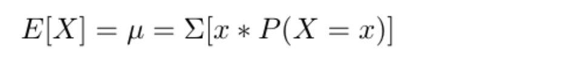
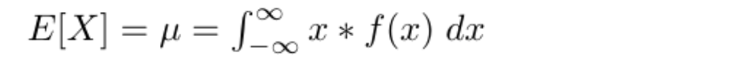
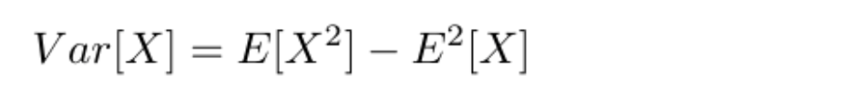
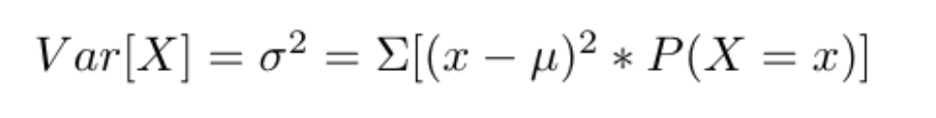
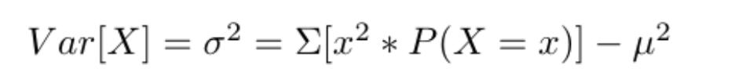

# Week 2 -- Part 2

## Week 2 Learning Objectives

By the end of Weeks 2 & 3, you will be able to

* Compare and contrast discrete and continuous distributions
* Describe the characteristics of and graphical appearance of probability distributions important for biology.
* Determine what probability distribution satisfies the necessary requirements given information and assumptions about data/processes.
* Use sample data to find actual results and use probabilities to find expected results.
* Describe the relation between population-based and sample-based information.
* Use estimation to infer or estimate the value of a population parameter given sample data.
* Differentiate between unbiased and biased estimators.
* Construct confidence intervals for estimated parameters.
* Describe the difference between the non-parametric and parametric bootstrap. Apply the bootstrap in confidence interval estimation and to compare two data sets.
* Determine minimum sample sizes necessary for estimation.
* Develop the ability to identify the null and alternative hypotheses when given some claim about a population
* Use sample data to test hypotheses or claims made about population parameters and state the conclusions in both technical terms (of rejecting or failing to reject the null hypothesis) and simple terms.
* Use hypothesis testing to test whether real and expected results differ significantly.
* Employ multiple hypothesis testing correction when appropriate.
* Accurately define, use, and compare p-values.

## Probability Distributions

### Parameters

Last lecture we broadly discussed the requirements of any probability distribution and the uses of the distribution to find expected results or the probability that a random variable takes on a specific value or a value in a specific range of values. There are many specific probability distributions, each of which has specific characteristics, assumptions, and *PMF*, *PDF*, or *CDF* functions. With a probability distribution, we have a description of a population. Therefore the *parameters* (such as a mean or expected value, the variance, or possibly the probability of success) of a given probability distribution are the parameters of the population too. The mean (expected value), standard deviation, and variance parameters can be computed for most probability distributions (exceptions are rare).

### Expected Value

The expected value of random variable is the predicted or likely outcome/value that a random variable will take on, essentially summarizing the center of the random variable or the mean.

If we want to find the expected value of a specific distribution, often a specific formula will be available that utilizes parameters from the definition of the distribution. However, we can also take the *expectation* for any random variable using the formulas below as a guide.

#### Expected Value -- Discrete cases

Given a *discrete random variable* X with a *PMF* P(X), which specifies the P(X = x) for every possible x in X, we can find the expected value parameter of the probability distribution using the following equation, where we sum across every value x. In this way, the expected value is a weighted average of the possible values of a random variable, where the weights are the probabilities from the PMF.

#### Expected Value -- Continuous cases

We can calculate an expected value for a continuous random variable given a *continuous random variable* X with a *PDF* f(x), which specifies the probability density, or the probability for a range of values. (If needed, please see [this video for a refresher on the probability density function (PDF)](https://youtu.be/6Osba2KLTuk).) The formula for calculating the expected value of a continuous random variable utilizes an integral rather than a summation and the PDF rather than the PMF. These differences are because of the nature of a continuous random variable and that the P(X=x) = 0 for all x. This function is still essentially a weighted average of all the possible values by using the integral (for summations of an infinite number of nearly width 0 rectangles).

### Variance

The variance measures the spread of the random variable around its center or expected value; it is the average of the squared deviations of the random variable from its mean or expected value. In general this is found by the following formula for both discrete and continuous random variables where the expectation-squared of the random variable is subtracted from the expectation of the squared random variable. (Recall that the *expectation* is how the expected value can be found)

Note that the standard deviation is still the square root of the variance.

Much like with the expected value, specific distributions often have specific formulas associated with them for calculating a distributions variance. These formulas utilize parameters from the definition of the distribution. However, we can use the above formula to find the variance for any random variable.

#### Variance -- Discrete cases

There are two formulas for finding the variance in the case of a discrete random variable. The first more closely matches the definition while the second is easier to compute manually.

### Common Distributions

For a random variable or set of data to be distributed according to a specific distribution, that means the parameters of that distribution are assumed to be true for that random variable's population; also, any assumptions or characteristics of the distribution must be reflected in the random variable or dataset as well. This could be as simple as the data being discrete data for a discrete distribution. We'll see more complex requirements of several distributions soon.

In biology, there are three common probability distributions which biological data are often distributed according to. These are the *Binomial*, *Poisson*, and *Gaussian (Normal)* distributions. The Binomial and Poisson distributions are discrete probability distributions while the Normal is a continuous probability distribution.

### Common Distributions -- Discrete

#### Binomial Distribution

The Binomial distribution is a probability distribution that describes the number of successes that are observed in n independent trials where the trials share the same probability of success.

The assumptions/characteristics of the Binomial distribution are
*
*
*
*

The PMF of the Binomial distribution is:

We can use the `dbinom()` function in R for this.

The CDF of the Binomial distribution is:

We can use the `pbinom()` function in R for this.

We can generate from the Binomial distribution in R using the `rbinom()` function.

Of special note, this distribution appears to break our requirement that random variables and distributions be numerical, not categorical data. 

#### Poisson Distribution

The Poisson distribution is a probability distribution used to model the number of times a rare event occurs.

The assumptions/characterists of the Poisson distribution are
*
*
*

The PMF of the Poisson distribution is:

We can use the `dpois()` function in R for this.

The CDF of the Poisson distribution is:

We can use the `ppois()` function in R for this.

We can generate from the Poisson distribution in R using the `rpois()` function.

### Common Distributions -- Continuous

#### Uniform Distribution

#### Normal (Gaussian) Distribution

The Normal distribution is a symmetric, bell-shaped probability distribution with mean mu and standard deviation sigma. If observations follow a normal distribution, the interval (mu +- 2*sigma) will contain 95% of the observations.  

### Statistical Inference

### Hypothesis testing intro

*Hypothesis testing* is an approach used in statistical inference to compare samples and populations or to compare samples with each other.

#### Null vs Alternative Hypothesis

The *null hypothesis* is the hypothesis being tested about a population and refers to a situation in which no difference exists. In technical terms, the outcome of a hypothesis test is to either *reject* or *fail to reject* the null hypothesis.  

The *alternative hypothesis* is the opposite of the *null hypothesis*, stating that a difference does exist. If a tailed alternative hypothesis, the direction of the difference is included. The *alternative hypothesis* is the conclusion when the *null hypothesis is rejected*.

## Lecture Note Resources

* Basic & Clinical Biostatistics (5th Edition), by Susan White, published by McGraw Hill
* Biostatistics for the Biological and Health Sciences (2nd Edition), by Marc Triola, Mario F. Triola, & Jason Roy, published by Pearson
* Modern Statistics for Modern Biology (2019), by Susan Holmes & Wolfgang Huber, published by Cambridge University Press
* [Intro to probability website](https://dlsun.github.io/probability/) by [Dennis Sun](https://dlsun.github.io/)
