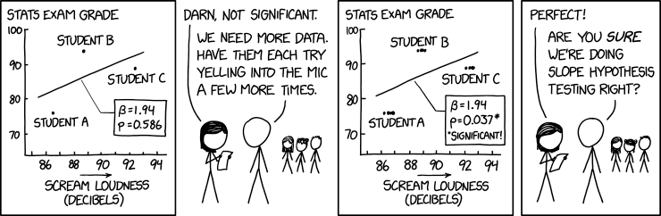

# Week 4

## Week 4 Learning Objectives

By the end of Week 4, you will be able to

* Differentiate between unbiased and biased estimators.
* Construct confidence intervals for estimated parameters.
* Describe the difference between the non-parametric and parametric bootstrap. Apply the bootstrap in confidence interval estimation and to compare two data sets.
* Determine minimum sample sizes necessary for estimation.
* Develop the ability to identify the null and alternative hypotheses when given some claim about a population
* Use sample data to test hypotheses or claims made about population parameters and state the conclusions in both technical terms (of rejecting or failing to reject the null hypothesis) and simple terms.
* Use hypothesis testing to test whether real and expected results differ significantly.
* Employ multiple hypothesis testing correction when appropriate.
* Accurately define, use, and compare p-values.
* Compute and describe the correlation between data sets.
* Discuss the differences between correlation and causation.
* Use regression to find the best equation describing a set of data.
* Using regression, predict outcomes given new data.

## Why are probability distributions important for us?

We've discussed that statistical inference is particularly interested in making observations about and drawing conclusions from a sample and using those observations and conclusions to make inferences specific to the overall population. This is because, in general, we often do not know the population parameters and cannot easily observe them by considering the whole population. And therefore we want to infer or predict the parameters from sample data. To do this, we make estimates of parameters and test hypotheses. We may know characteristics about this population, and so, we may know the probability distribution that the population is likely distributed by. This is important because this helps us to know (1) which statistics we want to estimate and (2) which hypotheses tests are appropriate and which are not.

## Estimation -- Point Estimates and Confidence Intervals

In several examples last week we calculated specific statistics for a sample such as the sample mean, a sample proportion, the sample probability of success, etc. In these cases, these were what are called *point estimates* for the corresponding population parameter. *Point estimates* involve specific numbers rather than an interval or a range. We are estimating the population parameter from the observed statistic. Point estimates are often notated as the summary stat or parameter's greek letter with a hat on it. But these point estimates do not reflect any uncertainty we have in the estimate, and we should have some uncertainty because we are estimating from a sample rather than looking at the population itself.

*Confidence Intervals* (CI) are one means of communicating this uncertainty. Rather than a specific value, a confidence interval is a range of values. A confidence interval is a *point estimate* +- a *margin of error*. The margin of error is found by using a *critical value* (which is related to a *confidence level*), the *standard deviation*, and the *number of samples*.
  * Specifically, the *confidence level* of a confidence interval is the probability 1 - alpha that the confidence interval actually does contain the population parameter, assuming the estimation process is repeated a large number of times.
    * *alpha* is also known as the *significance level*
  * If known, the population's standard deviation is used; otherwise, the sample's point estimate of the standard deviation should be used.

A *95% confidence interval is a random interval with a 95% probability of falling on the parameter we are estimating*. Keep in mind that saying 95% of random intervals will fall on the true value (our definition above) is not the same as saying there is a 95% chance that the true value falls in our interval (this latter statement is not accurate). (Note that 95% corresponds to an alpha of 0.05 and is a common CI, but other percentages/levels/alphas can be used.)      

### The Sampling distribution

There's another distribution that's important to us that we haven't discussed yet. This is called the *Sampling distribution*. The *Sampling distribution* is the probability distribution for estimators such as the sample mean by which we get point estimates. The reason estimators get their own distribution is that the value of the estimate depends on the specific sample selected from the population and will differ for each sample. If we repeat sampling many times, we will get many different values for the estimate, but we'll sometimes have overlap. For this reason, estimators are also considered random variables and have their own distribution, the *sampling distribution*. The reason this is so important is that the sampling distribution is often approximately normally distributed if the sample size is large enough and observations are independent. This approximate normal distribution of the sampling distribution is centered around the true value/parameter that we are trying to estimate. It's also due to something called the *Central Limit Theorem*. This is true no matter which distribution the original data is from. And this then allows us to find confidence intervals in the same way no matter the underlying data distribution, and to assume something called the 68-95-99.7% rule for normal distributions. We'll see examples of this in lecture.

## Hypothesis Testing

Many sources list the steps of a hypothesis test in different orders, but by far my favorite list is from the "Modern Statistics for Modern Biology" textbook by Susan Holmes and Wolfgang Huber. The order they suggest is below, and it has a lot of jargon that we will break down. But my favorite part of this suggested workflow or ordering of the steps is that it puts all of the decision steps before you even look at or begin working with the data. From the preview we had on hypothesis testing last week, we saw that there were several important decisions that could affect the outcome of the test this means that important decisions like the significance level cutoff, whether the test is two-tailed or one-tailed, etc are all happening before   

1. Decide on the effect that you are interested in, design a suitable experiment or study, pick a data summary function and *test statistic*
2. Set up a *null hypothesis*, which is a simple, computationally tractable model of reality that lets you compute the *null distribution* (the possible outcomes of the test statistic and their probabilities under the assumption that the null hypothesis is true)
3. Decide on the *rejection region* or the subset of possible outcomes whose total probability is small, for which you will reject the null hypothesis.
  * The *critical value* is the value that a test statistic must exceed (in an absolute value sense) for the null hypothesis to be rejected; it'll be test specific
4. Do the experiment and collect the data (or download the data if already available); compute the *test statistic* that was decided on in step 1.
5. Make a decision: reject the null hypothesis if the test statistic is in the rejection region or fail to reject the null hypothesis if the test statistic is not in the rejection region
  * In the case of rejecting the null hypothesis, we conclude that the null hypothesis is unlikely to be true
  * In the case of failing to reject the null hypothesis, we conclude that there is not enough evidence in the data to reject the null hypothesis.

### What is a test-statistic and its null distribution?

A *test-statistic* is a value that is used in making a decision about the null hypothesis. It is often found by converting observed sample (summary) statistics (e.g., mean, proportion, etc.) to a score (e.g., z, t, or chi-square, etc.) with the assumption that the null hypothesis is true. For these commonly used scores/test statistics, there are often closed-form equations/distributions. In these cases, how do you know which test-statistic to use? Note that all of these commonly used scores/test statistics require specific assumptions. We will cover the assumptions and what test-statistics you want to use later.

Note that for the major hypothesis-testing functions we used in R in class and the homework, the function computes the appropriate test-statistic for you. So as long as the assumptions of the test are met, the correct test-statistic will be computed.

It may be preferred at times to define a test-statistic not covered by the commonly used ones. If so, we use simulations to build a null distribution of values. This will be covered later in the course.

### Errors in Hypothesis Tests

The table below is called a classification table (or a confusion matrix). On the left of the table, we describe the action that is taken due to the outcome of the hypothesis test. On the top of the table, we describe the reality of the Null hypothesis (e.g. if it is true or false). For every conclusion from a hypothesis test, the conclusion is classified as one of the following "events": a *True positive*, a *True negative*, a *False positive*, or a *False negative*. Each cell in the table lists which combination of null hypothesis reality and hypothesis test outcome leads to each of these events. We will further break down each of the event labels.  

| Test Outcome vs Reality  | **Null hypothesis is true** | **Null hypothesis is false** |
|:------------------------ | :-------------------------: | :--------------------------: |
|**Reject null hypothesis**| Type I error/False Positive | True Positive                |
|**Do not reject null**    | True negative               | Type II error/False Negative |
{:.table.table-striped.well}

Such classification tables are often used in classifying outcomes for medical tests. Below, we will consider a screening or diagnostic test for HIV in blood donors as an example. This example won't have null and alternative hypotheses terms, but it's helpful for understanding the various event labels/classifications.

#### False Positives or Type I Errors

These errors are also known as false positives (FP) and they occur when we reject the null hypothesis but shouldn't. Earlier, we discussed *alpha* or the *significance level*, which is also the *false positive rate* or the probability of incorrectly rejecting the null hypothesis when it is actually true. In the case of a false positive, we are concluding there is a difference or a signal in the data when there is not.

For a known *alpha* and a known number of tests, you can expect a specific number of false positives. This number of expected false positives it equal to the number of tests multiplied by *alpha*.

For our example of screening for HIV in blood donors, a false positive would occur if the screening test returns that the blood sample is HIV positive when the donor in fact does not have HIV. In the case of blood donation, blood supplies often run low and donors are needed; therefore, we would want a very small false positive rate so we aren't turning away a blood donation, and potentially a reoccurring blood donor, when the blood is safe.

#### False Negatives or Type II Errors

These errors are also known as false negatives (FN) and they occur when we fail to reject the null hypothesis but we should have rejected it. The *false negative rate* is referred to as *beta*

For our example of screening for HIV in blood donors, a false negative would occur if the screening test returns that the blood sample is HIV negative when the donor in fact does have HIV. Due to the safety risks this blood poses to recipients, we would also want a very small false negative rate. While I've suggested with this biological example that we would want a small *false positive rate* and a small *false negative rate*, this cannot be achieved in practice. Being more conservative with and reducing the false positive rate has a trade-off in increasing the *false negative rate*.

#### True Positive

True positives occur when the null hypothesis should be rejected and there was enough evidence in the data to reject the null hypothesis, so we correctly do.

For our example of screening for HIV in blood donors, a true positive would occur if the screening test returns that the blood sample is HIV positive when the donor does in fact have HIV.

#### True Negative

True negatives occur when the null hypothesis should not be rejected and we correctly fail to reject the null hypothesis.

For our example of screening for HIV in blood donors, a true negative would occur if the screening test returns that the blood sample is HIV negative when the donor does in fact not have HIV.

### p-values & effect sizes

Last week when we were getting acquainted with the mechanics of hypothesis testing in R, we followed the old adage that results were statistically significant if p <= 0.05. But what is *p* and what does it mean? Why p <= 0.05? The 0.05 is commonly used as that's a small false positive rate. Here we'll define what a p-value is and discuss how p-values are commonly misunderstood or misused.

When a difference exists, the *effect size* communicates the magnitude of the difference. Effect size is discussed in this [Nature Methods article](https://raw.githubusercontent.com/bms5213-F2021/bms5213-F2021.github.io/master/docs/resourcedev/papers/Fickle_P-value.pdf) which we will focus on more when we consider power and power analyses

I highly recommend reading the The American Statistical Association (ASA) statement on statistical significance and P-values. This is linked on the course website already, and can be found [here](https://github.com/bms5213-F2021/bms5213-F2021.github.io/raw/master/docs/resourcedev/papers/asa_pval_statement.pdf), but I'll provide the highlights throughout the sections below.

#### Definitions

The *p-value* is the probability of getting a value of a test statistic that is *at least as extreme* as the test statistic obtained from the sample data, assuming that the null hypothesis is true.

The ASA statement says:

> Informally, a p-value is the probability under a specified statistical model that a statistical summary of the data (e.g., the sample mean difference between two compared groups) would be equal to or more extreme than its observed value.

#### What a p-value is and what a p-value isn't

A P-value is ...
* *A p-value can indicate how incompatible the data are with a specified statistical model.*
  * The statistical model is proposed for a particular set of data and is combined with a set of assumptions and a *null hypothesis*. As we've discussed, this *null hypothesis* states the absence of an effect (no difference between two groups), or the absence of a relationship between a factor (independent variable) and an outcome (dependent variable) (e.g. we've briefly discussed testing if the Beta parameters from regression are different from 0 or not).
  * The smaller the p-value, the greater the statistical incompatibility of the data with the null hypothesis if the assumptions are true. This provides evidence against the null hypothesis or the assumptions. Note however that this does not mean that smaller p-values are more important or have larger effects than other larger p-values. We'll discuss this later.
* A p-value depends on both the sample size(s) and the observed effect size (or difference between what is being compared). In this sense, the p-value is *confounded* since both the effect size and the sample size are part of deriving the p-value.

A P-value isn't ...

* *A p-value does not measure the probability that the studied hypothesis is true, or the probability that the data were produced by random chance alone.* P-values cannot provide proof of the alternative hypothesis. Additionally, while the null hypothesis has an implicit assumption that two things are equal, and any deviation from this equality could be from chance, if the null hypothesis is true, stating conclusions in terms of "random chance" can often be misleading.

* *A p-value, or statistical significance, does not measure the size of an effect or the importance of a result* The effect size is part of calculating the p-value but the p-value does not report the actual effect size. Nor does the size of the p-value automatically tell us something about the effect size. Similarly, if a sample size is too small, a large effect size may have a large/non-significant p-value.

* *By itself, a p-value does not provide a good measure of evidence regarding a model or hypothesis* Data analyses should not end with calculating a p-value; rather hypothesis testing should be used in conjunction with other approaches, especially if deciding between multiple models. P-values should not be reported by themselves, but rather should be reported together with confidence intervals and effect sizes.

#### What we shouldn't do with p-values

* Because p-values depend on the sample size as well as the effect size, it is not appropriate to compare the size of p-values to each other. One being smaller than the other could be due to differences in sample sizes. Here's an example in an xkcd comic where by increasing the sample size the researchers can find a p-value < 0.05. The fact that sample size has an effect on hypothesis testing outcomes is another reason why it is so important to decide on sample size and other logistics before ever collecting or looking at the data (as we discussed in the first section of these lectures notes)

* If we want to make conclusions or decisions like choosing between models, there are other methods we can use like likelihood ratios, etc, which we will discuss later. Of importance, we should consider study designs, data quality, external evidence, validity of assumptions for the phenomenon under study as well as the data analysis. There are comical examples where p-values can be below the common threshold for significance but the claim is outrageous. The below figure from an [article by Regina Nuzzo (which I would also recommend reading)](https://github.com/bms5213-F2021/bms5213-F2021.github.io/raw/master/docs/resourcedev/papers/Fickle_P-value2.pdf) makes the point that we should consider how likely the hypothesis is to begin with or how much the actual observed difference means to us. The article has a fantastic example of a survey on the divorce rate and happiness for couples who met online. Another example in the Biostatistics with R textbook in chapter 7, pg 180 about body temperature, where with a large enough sample size we could show a statistically significant difference between 98.25 and 98.6 degrees for healthy individuals. In practice, we likely wouldn't consider this effect size of 0.35 to be biologically relevant.

### Multiple Hypothesis Testing Motivation

As discussed earlier, the false positive rate multiplied by the number of tests that are performed can give you an estimate of the number of false positive statistically significant results you can expect. In this example xkcd comic below, there are 21 hypothesis tests and a false positive rate of 0.05. We see one false positive.

Therefore, when there are many hypotheses tests, we often further control the threshold for statistical significance so as to reduce the number of "acceptable" false positives. We will discuss these methods later.

### Looking forward -- Alternatives and additions to the p-value, calculating sample sizes + power analyses, Multiple hypothesis testing methods

## References
* [Biostatistics with R](https://bms5213-f2021.github.io/resourcedev/textbook_pdfs/Shahbaba2012_Book_BiostatisticsWithR.pdf)
* [Statistical Errors by Regina Nuzzo](https://github.com/bms5213-F2021/bms5213-F2021.github.io/raw/master/docs/resourcedev/papers/Fickle_P-value2.pdf)
* [The fickle P value generates irreproducible results](https://raw.githubusercontent.com/bms5213-F2021/bms5213-F2021.github.io/master/docs/resourcedev/papers/Fickle_P-value.pdf)
* [ASA Statement](https://github.com/bms5213-F2021/bms5213-F2021.github.io/raw/master/docs/resourcedev/papers/asa_pval_statement.pdf)
* [Using Effect Size—or Why the P Value Is Not Enough](https://www.ncbi.nlm.nih.gov/pmc/articles/PMC3444174/)
* Basic & Clinical Biostatistics (5th Edition), by Susan White, published by McGraw Hill
* Biostatistics for the Biological and Health Sciences (2nd Edition), by Marc Triola, Mario F. Triola, & Jason Roy, published by Pearson
* Modern Statistics for Modern Biology (2019), by Susan Holmes & Wolfgang Huber, published by Cambridge University Press
* [Data Analysis for the Life Sciences](https://bms5213-f2021.github.io/resourcedev/textbook_pdfs/dataanalysisforthelifesciences.pdf)
